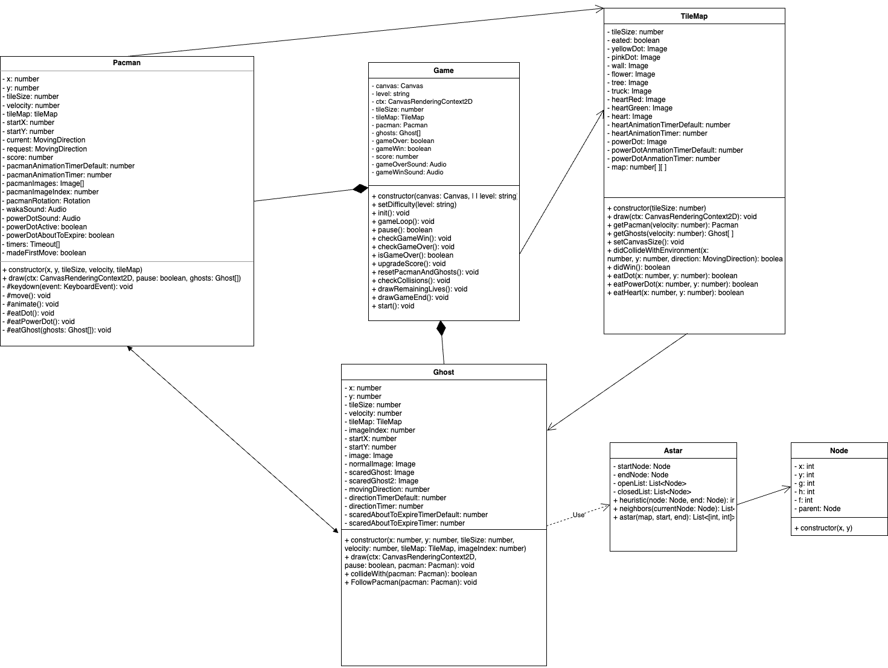

<!-- PROJECT LOGO -->
 

<!--      -->
</a>

<h3 align="center">ALGORITHM & DATA STRUCTURES</h3>

  

    An online game created with HTML, CSS, Javascript for Algorithm & Data Structures course in International University - VNUHCM!
     
     
  

<!-- TABLE OF CONTENTS -->

# Table of contents :round_pushpin:

1. [Introduction](#Introduction)
2. [Techniques](#Techniques)
3. [Features](#Features)
4. [Acknowledgments](#Acknowledgments)

## Introduction  :bricks:

<!--  -->

Intro

### Abstract :mechanical_arm:

This project focuses on developing a real-time AI pathfinder, a crucial component in some applications like gepgraphical mapping, IP routing, telephone networks,etc..

The AI, unlike a standard enemy-player tracker, will utilize various search algorithms to dynamically find the shortest path to the player, completely navigating through blocks( obstables).

Our goal is to make a pathfinder that is not only efficient in determining the shortest path but also can be adaptable to changing target and obstacles.

### Getting Started :mechanical_arm:

You can simply double click on `menu.html` or click straight to `index.html`  and use the app. 

### Why is A*? :mechanical_arm:
A* is chosen for pathfinding in this scenario because it is more efficient than BFS, especially in large and complex environments. A* uses a heuristic to direct its search towards the target, leading to faster solutions. Additionally, it guarantees an optimal path if one exists, unlike BFS which is less efficient in large search spaces.

### UML

    

## Techniques :joystick:

- Language: [JavaScript](https://www.javascript.com)

 

<!-- FEATURES -->

## Features :joystick:
### UML Diagram

    <!--  -->

## Acknowledgments<a name="Acknowledgments">:brain:

We would want to express our gratitude to Dr. Vi Chi Thanh for providing us with the chance to participate in this
project and apply what we learned in theory into practice. This project's learning curve was steep, but it was well
worth it for all of us. We have learned more about interface technologies to construct a functioning application that
interacts with our project. Sir, we want to thank you again for all the hard work and expertise that you have put into
your teaching. We'll make sure that all we've learned doesn't go to waste, and that we can master them better from now
on :heart:

 

## References<a name="References">  :eye::tongue::eye:

 

<a href="#top">Back to top ↑</a>

